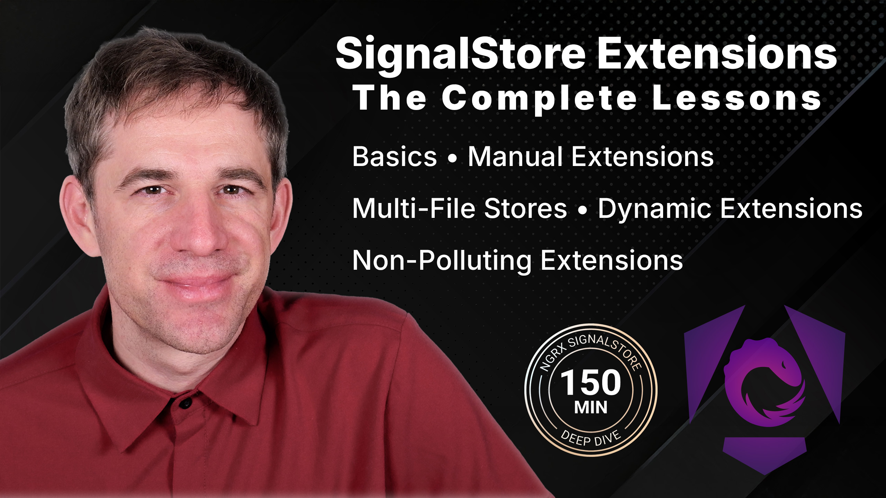

# NgRx SignalStore Extensions



Demo repository for the video:

https://youtu.be/dM9lfElODK4

The repository contains the code steps for building and using NgRx SignalStore extensions in an Angular application. Each branch represents one step in the video, so you can compare the implementation as it evolves.

## Branches

- `main` / `0-init`: starting point
- `1-basics`: basic SignalStore extension setup
- `2-self-written`: first custom extension
- `3-deep-dive`: closer look at how extensions compose
- `4-multiple-files`: splitting the implementation across files
- `5-builder-pattern`: using a builder-style API
- `6-dynamic-features`: adding dynamic behavior
- `7-non-polluting-features`: avoiding unwanted public API pollution

## Getting Started

Install dependencies:

```bash
npm install
```

Start the Angular application:

```bash
npm start
```

Run the test suite:

```bash
npm test
```

## Switching Steps

Use Git branches to move between the video steps:

```bash
git switch 0-init
git switch 1-basics
git switch 7-non-polluting-features
```

To inspect what changed between two steps:

```bash
git diff 1-basics..2-self-written
```
